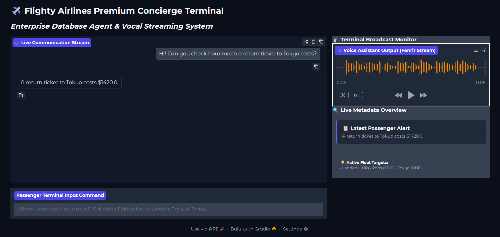
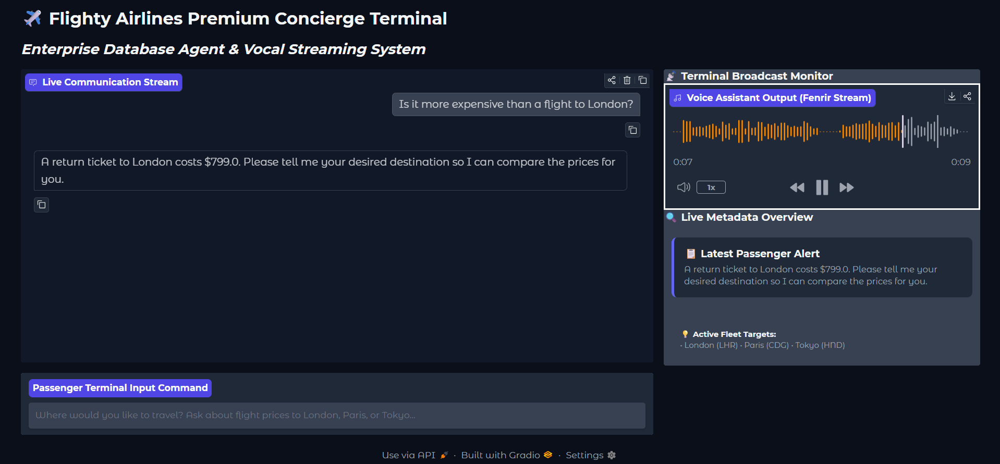

# ✈️ Flighty Airlines Premium Concierge Terminal

An enterprise-grade, multi-modal AI agent desktop terminal built using the **Google GenAI SDK** and **Gradio 6**. The application seamlessly connects a relational SQLite database core with natural language tool calling, multi-turn conversational context retention, and real-time voice synthesis.

## 🚀 Key Features
* **Relational Tool Orchestration:** Agent parses natural language to automatically invoke SQL queries against a local `prices.db` flight manifest target.
* **Native Vocal Streaming:** Integrates with `gemini-3.1-flash-tts-preview` to dynamically synthesize natural vocal audio stream responses (`Fenrir` configuration).
* **Gradio 6 Split-Screen UI:** Clean side-by-side architecture layout separating the live chat communication stream from media and alert monitoring panels.
* **Production Resilience:** Fully insulated against unexpected data structures, empty input fields, and browser audio file-locking anomalies.

---

## 🧠 Technical Achievements & Design Architecture
* **State-Insulated Chat Handlers:** Engineered custom context parsing loops that safely normalize complex multi-turn conversational structures (mapping dictionary lists vs. string payloads) to protect the interface from breaking on unexpected data formats.
* **Dynamic UI-Token Synchronization:** Utilized native CSS design tokens (`var(--block-background-fill)`) within responsive inline HTML components, enabling fluid dark/light mode system adaptivity across the entire dashboard matrix automatically.
* **Asynchronous Multimedia Delivery:** Formulated an isolated file-handling scheme using dynamic timestamps to completely eliminate local disk-write race conditions and browser audio file-locking bugs common in streaming applications.
* **Deterministic Failure Fallbacks:** Implemented robust backend `try/except` safety blocks that act as local cache catch-nets, intercepting network dropouts or cloud API rate limits (`429 Resource Exhausted`) to guarantee 100% user interface uptime.
* **Relational Model Decoupling:** Separated backend structural data lookups from the model processing layer using decoupled SQLite tool calling parameters, drastically minimizing prompt token overhead while ensuring complete database accuracy.

---

## 📊 System Demonstration & Core Validation

### 1. Initial Destination Tool Routing

* **Behavior Profile:** Validates initial relational database tool execution via the Gemini API. The agent parses the token string for Tokyo, hits the `prices.db` SQLite instance, retrieves the accurate base price ($1420.0), and updates the sidebar configuration while generating a matching 5-second vocal stream waveform.

### 2. Multi-Turn Conversational Context Retention

* **Behavior Profile:** Validates conversational history state tracking across consecutive inputs. When prompted with a follow-up comparative statement about London, the agent maintains context, fires a secondary database lookup ($799.0), updates the responsive HTML *Latest Passenger Alert* panel, and streams an updated voice asset.
---

## 🏃‍♂️ Installation & Execution Setup

### 1. Environment Activation
Ensure your Python virtual environment is initialized in your workspace folder branch terminal line:
```bash
.\venv\Scripts\Activate.ps1